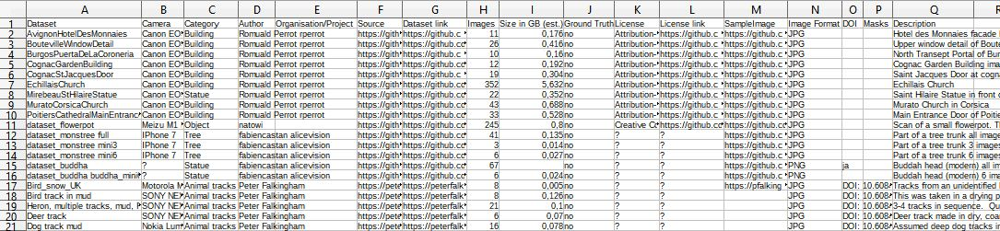

# Photogrammetry Datasets

This is a collection of datasets for photogrammetry.

A csv-table with **350+ datasets** can be downloaded from this repository: [**datasets.csv**](./datasets.csv).

**Contents**

Dataset,Camera,Category,Author,Organisation/Project,Source,Dataset link,Images,Size in GB,Ground Truth,License,License link,SampleImage,Image Format,DOI,Masks,Description

The list includes a large variety of image sets and sizes.
From small (<20MB), medium (1GB-5GB) to large (up to 350GB) datasets.

**Contributions are welcome**

# Good source

https://openheritage3d.org/data

# New

https://github.com/AlansCodeLog/photogrammetry-test-sets 

http://vision.ia.ac.cn/zh/data/index.html Chinese historical buildings 1-5gb (提取码 -> passcode)

http://gpcv.whu.edu.cn/data/WHU_MVS_Stereo_dataset.html large aerial city dataset 57gb with ground truth

https://gumroad.com/l/dSAzI https://wetransfer.com/downloads/59795479cb473c3f64ce26d2c897381020200130025221/4bd61bd60b355c0fd127625b5795785820200130025221/d65978 shared by smallpoly via reddit

["American Rodeo Cowboy"](https://www.dropbox.com/sh/rbegeqgihpp6xwj/AAAWZFLvBCG5PlPIk059vVJpa?dl=0) by hargrovecompany

https://harvest4d.org/?page_id=1367
Creative Commons Attribution (CC-BY) 

https://www.gcc.tu-darmstadt.de/home/proj/ambient_point_clouds/apc.en.jsp

https://www.eth3d.net/datasets

https://www.visuallocalization.net/datasets/

https://www.opendronemap.org/odm/datasets/

https://www.capturingreality.com/SampleDatasets

https://data.mendeley.com/datasets/vfz5pz4n8k/3

https://github.com/YoYo000/BlendedMVS

https://github.com/lzx551402/GL3D

https://dronemapper.com/sample_data/

https://github.com/QingyongHu/SensatUrban - Cambridge urban aerial image dataset 

# Not accessible
https://lightfield.stanford.edu/lfs.html
https://gmv.cast.uark.edu/index.html
